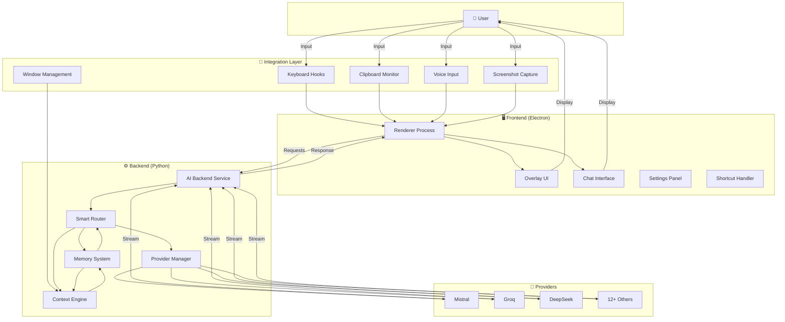
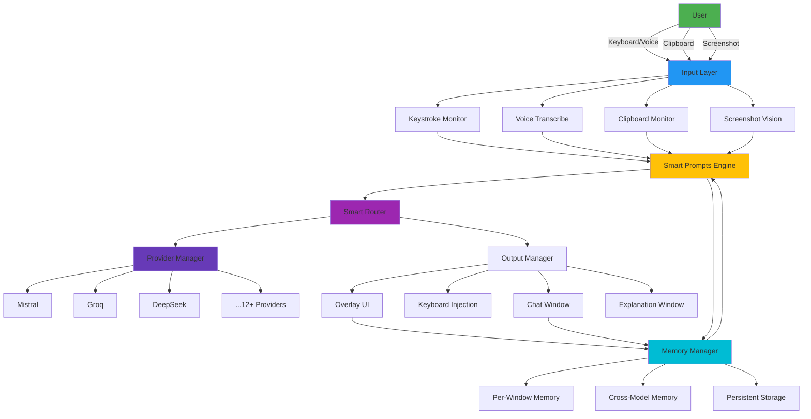

# Prod_Layer Architecture: Unified Intelligence Layer

## One-Page Architecture Diagram



## High-Level System Architecture

```
┌───────────────────────────────────────────────────────────────────────────────┐
│                        PROD_LAYER ARCHITECTURE                               │
├───────────────────────┬───────────────────────┬───────────────────────────┤
│   FRONTEND (Electron)  │   BACKEND (Python)    │    INTEGRATION LAYER      │
├───────────────────────┼───────────────────────┼───────────────────────────┤
│  - Renderer Process   │  - AI Backend Service │  - Keyboard Hooks        │
│  - Overlay UI         │  - Provider Manager   │  - Clipboard Monitor     │
│  - Chat Interface     │  - Smart Router       │  - Voice Input           │
│  - Settings Panel     │  - Memory System      │  - Screenshot Capture    │
│  - Shortcut Handler   │  - Context Engine      │  - Window Management     │
└───────────────────────┴───────────────────────┴───────────────────────────┘
```

## Detailed Component Diagram



## Layered Architecture Breakdown

### 1. Input Layer (System Integration)
```
┌───────────────────────────────────────────────────────────────┐
│                     INPUT LAYER                                │
├───────────────────┬───────────────────┬───────────────────┤
│  Keystroke Monitor│  Clipboard Monitor│  Voice Transcribe  │
│  - Global hotkeys │  - Content type   │  - Hold-to-talk   │
│  - Window focus   │    detection      │  - Speech-to-text │
│  - Modifier keys  │  - Format         │  - Noise reduction│
│                   │    preservation   │                   │
├───────────────────┼───────────────────┼───────────────────┤
│  Screenshot Vision│  Window Manager   │  Privacy Filter   │
│  - Region capture │  - Focus tracking │  - Sensitive data │
│  - OCR            │  - Title detection│    redaction      │
│  - Object         │  - Screen share   │                   │
│    detection      │    detection      │                   │
└───────────────────┴───────────────────┴───────────────────┘
```

### 2. Processing Layer (Intelligence Core)
```
┌───────────────────────────────────────────────────────────────┐
│                   PROCESSING LAYER                              │
├───────────────────┬───────────────────┬───────────────────┤
│  Smart Prompts     │  Smart Router     │  Memory System    │
│  - Content type    │  - Model selection│  - Per-window     │
│    detection      │  - Complexity     │    context        │
│  - Intent analysis │    analysis       │  - Session       │
│  - Task           │  - Cost           │    persistence    │
│    classification  │    optimization   │  - Cross-model    │
│                   │  - Fallback       │    sharing        │
│                   │    handling       │                   │
├───────────────────┼───────────────────┼───────────────────┤
│  Provider Manager │  Context Engine   │  AI Backend       │
│  - 12+ providers  │  - Conversation   │  - Streaming      │
│  - Unified API    │    history        │    responses      │
│  - Load balancing │  - Window context │  - Error handling  │
│  - Rate limit     │  - Task context   │  - Retry logic    │
│    handling       │                   │                   │
└───────────────────┴───────────────────┴───────────────────┘
```

### 3. Output Layer (Workflow Integration)
```
┌───────────────────────────────────────────────────────────────┐
│                     OUTPUT LAYER                               │
├───────────────────┬───────────────────┬───────────────────┤
│  Overlay UI       │  Keyboard Inject  │  Chat Interface   │
│  - Markdown       │  - Human-like     │  - Persistent     │
│    rendering      │    typing         │    conversations │
│  - Syntax         │  - Speed variation│  - Model          │
│    highlighting   │  - Error          │    selection      │
│  - Code blocks    │    simulation    │  - Search         │
│                   │  - Navigation     │                   │
├───────────────────┼───────────────────┼───────────────────┤
│  Explanation      │  Settings Panel   │  Notification     │
│  Window           │  - API key        │  System           │
│  - Code walkthrough│    management    │  - Toast          │
│  - Step-by-step   │  - Model          │    notifications  │
│    breakdown      │    selection      │  - Error alerts   │
│                   │  - Feature        │                   │
│                   │    toggles        │                   │
└───────────────────┴───────────────────┴───────────────────┘
```

## Data Flow Architecture

```
┌───────────────────────────────────────────────────────────────┐
│                    DATA FLOW: CODE EXPLANATION                 │
├───────────────────────────────────────────────────────────────┤
│  1. User copies code (Ctrl+C)                                  │
│  2. Clipboard monitor detects content                          │
│  3. Smart prompts classifies as "code"                        │
│  4. Memory system retrieves window context                     │
│  5. Smart router selects DeepSeek Reasoner                      │
│  6. Provider manager sends request                              │
│  7. AI backend streams response                                 │
│  8. Output manager renders in overlay                           │
│  9. Memory system stores conversation                           │
│  10. User continues work without context switch                 │
└───────────────────────────────────────────────────────────────┘
```

## Technologies to be used in the solution

| Layer | Technology | Purpose |
|-------|------------|---------|
| **Desktop shell** | Electron 20+ | Cross-platform app, window management, IPC |
| **Frontend** | HTML5 / CSS3 / JavaScript | Overlay UI, chat, settings, shortcut handling |
| **Rendering** | Marked.js | Markdown and code in overlay/chat |
| **Runtime** | Node.js 16+ | Main process, config, encrypted keystore |
| **Backend** | Python 3.8+ | AI service, routing, memory, integrations |
| **AI / LLM** | LiteLLM, OpenAI client | Multi-provider (12+), streaming, fallbacks |
| **Memory** | LangChain (langchain-core, langchain-community) | Conversation memory, context, persistence |
| **Vision** | Google GenAI, Pillow, mss | Screenshot capture and vision analysis |
| **Input** | pynput, keyboard | Global hotkeys, keyboard injection |
| **Voice** | PyAudio, SpeechRecognition | Hold-to-talk speech-to-text |
| **System** | pywin32 (Windows), psutil | Window focus, process info, screen-share handling |
| **Clipboard** | pyperclip | Clipboard monitoring and content detection |
| **Testing** | pytest, pytest-mock | Backend and provider tests |

---

## Technical Stack Diagram

```
┌───────────────────────────────────────────────────────────────┐
│                     TECHNICAL STACK                            │
├───────────────────┬───────────────────┬───────────────────┤
│  FRONTEND          │  BACKEND           │  INTEGRATION       │
├───────────────────┼───────────────────┼───────────────────┤
│  Electron 20+     │  Python 3.8+      │  pynput           │
│  HTML5/CSS3/JS   │  LiteLLM           │  pywin32          │
│  Marked.js        │  LangChain         │  Pillow / mss     │
│  Node.js          │  AsyncIO           │  PyAudio          │
│                   │  google-genai      │  pyperclip        │
├───────────────────┼───────────────────┼───────────────────┤
│  Testing           │  Testing           │                   │
│  (manual / E2E)   │  pytest            │                   │
│                   │  pytest-mock       │                   │
└───────────────────┴───────────────────┴───────────────────┘
```

## Key Architectural Decisions

### 1. Electron + Python Hybrid
```
Pros:
✓ Cross-platform compatibility
✓ Rich UI capabilities
✓ Python AI ecosystem access
✓ System-level integration

Cons:
✗ Larger footprint
✗ Process communication overhead
✗ Security considerations
```

### 2. Multi-Provider Abstraction
```
┌───────────────────────────────────────────────────────────────┐
│                     PROVIDER ABSTRACTION                       │
├───────────────────────────────────────────────────────────────┤
│  User → Prod_Layer Interface → LiteLLM → 12+ Providers        │
│                                                                 │
│  Benefits:                                                     │
│  • Single API for all models                                   │
│  • Automatic fallback handling                                 │
│  • Unified error management                                   │
│  • Cost optimization                                           │
└───────────────────────────────────────────────────────────────┘
```

### 3. Memory Architecture
```
┌───────────────────────────────────────────────────────────────┐
│                     MEMORY SYSTEM DESIGN                       │
├───────────────────────────────────────────────────────────────┤
│  Per-Window Memory → Cross-Model Memory → Persistent Storage  │
│                                                                 │
│  Structure:                                                    │
│  • window_id: {                                               │
│      conversations: [                                         │
│          {role, content, timestamp, model}                   │
│      ],                                                        │
│      metadata: {app, title, focus_time}                      │
│    }                                                           │
│                                                                 │
│  Features:                                                     │
│  • Automatic context capping                                   │
│  • Session persistence                                         │
│  • Cross-model sharing                                         │
│  • Privacy filters                                            │
└───────────────────────────────────────────────────────────────┘
```

## Performance Characteristics

```
┌───────────────────────────────────────────────────────────────┐
│                     PERFORMANCE METRICS                        │
├───────────────────────────────────────────────────────────────┤
│  Component            │ Response Time │ Throughput       │
├───────────────────────────────────────────────────────────────┤
│  Keyboard Shortcut    │ <50ms          │ 100+ events/sec  │
│  Clipboard Processing │ <100ms         │ 50+ events/sec   │
│  Smart Routing         │ <200ms         │ 20+ requests/sec │
│  AI Response           │ 500-2000ms     │ Model dependent  │
│  Memory Operations     │ <30ms          │ 1000+ ops/sec    │
└───────────────────────────────────────────────────────────────┘
```

## Security Architecture

```
┌───────────────────────────────────────────────────────────────┐
│                     SECURITY DESIGN                            │
├───────────────────────────────────────────────────────────────┤
│  1. API Key Management                                         │
│     • Encrypted storage (keystore.js)                          │
│     • Environment validation                                   │
│     • Per-provider isolation                                   │
│                                                                 │
│  2. Data Privacy                                               │
│     • Local memory storage                                      │
│     • No telemetry by default                                   │
│     • Privacy filters for sensitive data                      │
│                                                                 │
│  3. System Integration                                         │
│     • Admin privileges for hooks                               │
│     • Process isolation                                        │
│     • Input validation                                          │
└───────────────────────────────────────────────────────────────┘
```

## Deployment Architecture

```
┌───────────────────────────────────────────────────────────────┐
│                     DEPLOYMENT MODELS                          │
├───────────────────────────────────────────────────────────────┤
│  Model               │ Description                              │
├───────────────────────────────────────────────────────────────┤
│  Local Development   │ npm start + Python backend               │
│  Packaged App        │ Electron builder (future)                │
│  Enterprise          │ Centralized config + local instances     │
│  Cloud Backend       │ Optional cloud memory sync (future)      │
└───────────────────────────────────────────────────────────────┘
```

## Future Architecture Evolution

```
┌───────────────────────────────────────────────────────────────┐
│                     FUTURE ENHANCEMENTS                       │
├───────────────────────────────────────────────────────────────┤
│  1. Cloud Sync: Cross-device memory synchronization            │
│  2. Team Sharing: Collaborative memory spaces                  │
│  3. Plugin System: Extensible providers                        │
│  4. Edge AI: Local model caching                               │
│  5. Mobile: Companion app for continuity                       │
└───────────────────────────────────────────────────────────────┘
```

## Architecture Summary

**Prod_Layer represents a novel architecture for AI integration:**

1. **Unified Access Layer** - Single interface to all AI capabilities
2. **Persistent Memory Fabric** - Context that travels across applications
3. **Workflow-Native Integration** - Non-disruptive access patterns
4. **Multi-Provider Abstraction** - Future-proof model access
5. **Cross-Platform Design** - Windows primary, macOS/Linux compatible

This architecture solves the fragmentation problem by creating a cohesive intelligence layer that lives alongside work, rather than requiring work to adapt to tools.

