# Use Case Diagram: Prod_Layer Intelligence Layer

```mermaid
graph TD
    %% Main Actor
    A[Knowledge Worker] -->|Uses| B[Prod_Layer]

    %% Core Use Cases
    B --> C1[Unified AI Access]
    B --> C2[Persistent Memory]
    B --> C3[Workflow Integration]
    B --> C4[Smart Automation]

    %% Unified AI Access
    C1 --> D1["Switch between 12+ AI models"]
    C1 --> D2["Access all models from any app"]
    C1 --> D3["Unified interface for all AI tasks"]

    %% Persistent Memory
    C2 --> E1["Cross-application context"]
    C2 --> E2["Session persistence"]
    C2 --> E3["Per-window memory"]
    C2 --> E4["Cross-model memory sharing"]

    %% Workflow Integration
    C3 --> F1["Keyboard shortcuts"]
    C3 --> F2["Overlay UI"]
    C3 --> F3["Screen-share invisible"]
    C3 --> F4["Multi-modal input"]

    %% Smart Automation
    C4 --> G1["Auto-detect content type"]
    C4 --> G2["Context-aware responses"]
    C4 --> G3["Human-like typing"]
    C4 --> G4["Smart routing"]

    %% Specific Scenarios
    A -->|Developer| H1["Get code explanations"]
    A -->|Researcher| H2["Quick definitions"]
    A -->|Professional| H3["Meeting prep"]
    A -->|Interviewer| H4["Human-like coding"]

    %% Benefits
    B --> I1["Save 2.8 hrs/day"]
    B --> I2["40% less switching"]
    B --> I3["Single mental model"]
    B --> I4["Deep work enabled"]

    style A fill:#4CAF50,stroke:#388E3C
    style B fill:#2196F3,stroke:#1976D2
    style C1 fill:#FFC107,stroke:#FFA000
    style C2 fill:#FFC107,stroke:#FFA000
    style C3 fill:#FFC107,stroke:#FFA000
    style C4 fill:#FFC107,stroke:#FFA000
```



## Detailed Use Cases

### 1. Developer Workflow
```
┌───────────────────────────────────────────────────────────────┐
│  USE CASE: Get Instant Code Explanation                        │
├───────────────────────────────────────────────────────────────┤
│  Primary Actor: Developer                                      │
│  Preconditions: Code is copied to clipboard                    │
│  Main Flow:                                                    │
│  1. Developer copies complex code                              │
│  2. Presses Ctrl+Shift+D                                      │
│  3. Prod_Layer detects code content                            │
│  4. System selects optimal model (DeepSeek Reasoner)          │
│  5. Explanation appears in overlay                             │
│  6. Developer continues work without tab switching            │
│  Postconditions: Context saved for future reference            │
└───────────────────────────────────────────────────────────────┘
```

### 2. Research Workflow
```
┌───────────────────────────────────────────────────────────────┐
│  USE CASE: Quick Technical Definition                          │
├───────────────────────────────────────────────────────────────┤
│  Primary Actor: Researcher                                     │
│  Preconditions: Researching technical concept                  │
│  Main Flow:                                                    │
│  1. Researcher copies term "OOP"                              │
│  2. Presses Ctrl+Shift+D                                      │
│  3. System detects definition request                          │
│  4. Selects fast model (Groq Llama 3.3)                       │
│  5. 25-35 word definition appears                              │
│  6. Researcher pastes into notes without formatting            │
│  Postconditions: Term stored in session memory                │
└───────────────────────────────────────────────────────────────┘
```

### 3. Meeting Professional Workflow
```
┌───────────────────────────────────────────────────────────────┐
│  USE CASE: Invisible Meeting Assistance                        │
├───────────────────────────────────────────────────────────────┤
│  Primary Actor: Professional in Zoom meeting                   │
│  Preconditions: Screen sharing enabled                        │
│  Main Flow:                                                    │
│  1. Professional needs quick information                       │
│  2. Presses Ctrl+Shift+D (overlay appears)                    │
│  3. Window remains invisible in screen share                   │
│  4. Gets concise answer without disrupting meeting             │
│  5. Continues presentation seamlessly                         │
│  Postconditions: Meeting context preserved                    │
└───────────────────────────────────────────────────────────────┘
```

### 4. Interview Preparation
```
┌───────────────────────────────────────────────────────────────┐
│  USE CASE: Human-Like Coding Interview Practice                │
├───────────────────────────────────────────────────────────────┤
│  Primary Actor: Job Candidate                                  │
│  Preconditions: Ultra Human Typing enabled                    │
│  Main Flow:                                                    │
│  1. Candidate copies coding problem                            │
│  2. Enables Ultra Human Typing mode                           │
│  3. Presses Ctrl+Shift+P                                      │
│  4. System generates code with:                               │
│     - Main skeleton with pass statements                       │
│     - Navigates to add helper functions                        │
│     - Returns to implement main logic                         │
│     - Includes realistic typos and corrections                │
│  5. Code appears with natural typing speed                     │
│  Postconditions: Candidate gains interview practice           │
└───────────────────────────────────────────────────────────────┘
```

## System Architecture Flow

```
┌───────────────────────────────────────────────────────────────┐
│                    PROD_LAYER ARCHITECTURE                     │
├───────────────────┬───────────────────┬───────────────────┤
│  Input Layer      │  Processing Layer │  Output Layer     │
├───────────────────┼───────────────────┼───────────────────┤
│  - Keyboard       │  - Smart Router   │  - Overlay UI     │
│  - Clipboard      │  - Provider       │  - Keyboard       │
│  - Voice          │    Manager        │    Injection      │
│  - Screenshot     │  - Memory System  │  - Chat Window    │
│                   │  - Context Engine │                   │
└───────────────────┴───────────────────┴───────────────────┘
                       ↓
┌───────────────────────────────────────────────────────────────┐
│                      DATA FLOW EXAMPLE                         │
├───────────────────────────────────────────────────────────────┤
│  1. User presses Ctrl+Shift+D (clipboard trigger)             │
│  2. Keystroke monitor captures event                           │
│  3. Smart prompts detects content type (code)                  │
│  4. Memory system retrieves window context                     │
│  5. Smart router selects optimal model                         │
│  6. AI backend generates response                              │
│  7. Output rendered in overlay                                 │
│  8. Context saved to persistent storage                        │
└───────────────────────────────────────────────────────────────┘
```

## Key Differentiators in Workflow

1. **Unified Access Pattern**
   ```
   Any App → Same Shortcut → Same Interface → Any AI Model
   ```

2. **Context Continuity**
   ```
   Browser Research → IDE Implementation → Meeting Presentation
   ↑───────────────────────────────────────────────────────┘
   Continuous memory across applications
   ```

3. **Non-Disruptive Integration**
   ```
   Workflow → [Prod_Layer] → Workflow (no context switch)
   ```

4. **Intelligence Portability**
   ```
   Model A → Memory → Model B (seamless switching)
   ```

